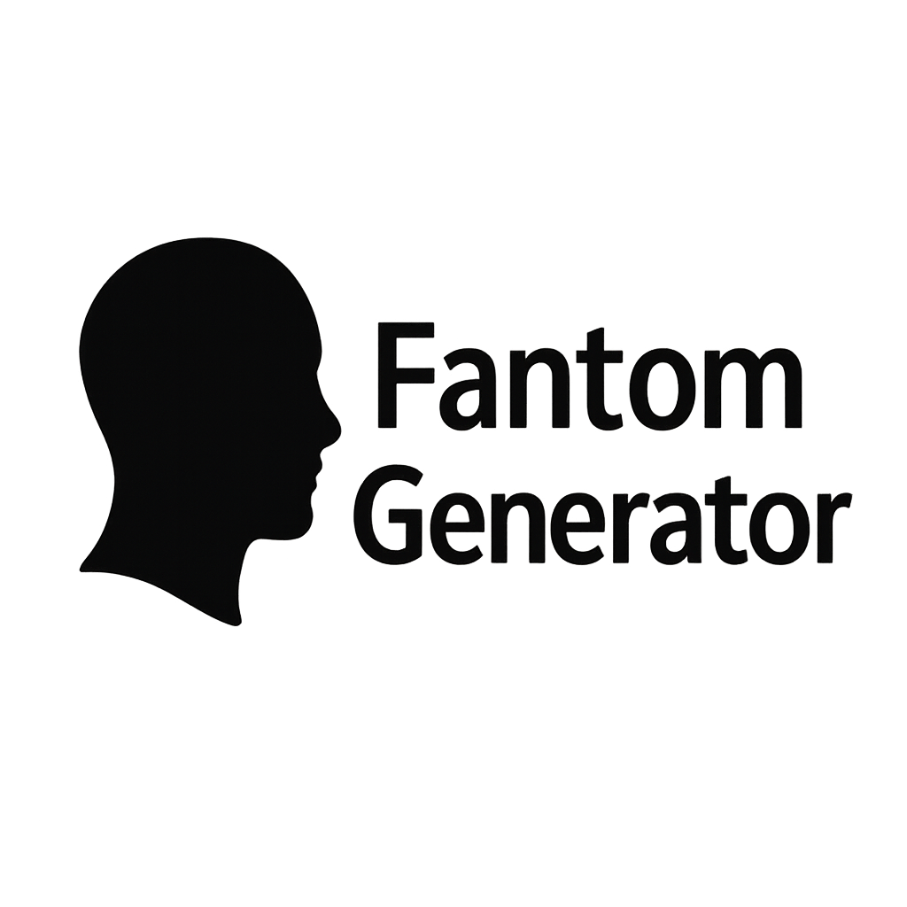

<p align="center">
  
</p>

# Fantom Generator

A web application for law enforcement to generate textual composite sketches (prompts) based on witness descriptions using adjustable visual parameters. The application focuses on robust prompt generation and data management via JSON.

## 🎯 Purpose

The Fantom Generator is designed to help police investigators and witness handling teams quickly capture and standardize physical descriptions in a structured format. It provides a modern, efficient alternative to traditional manual methods.

## 🚀 Features

- **Real-time Prompt Generation**: Dynamic text generation based on parameter adjustments
- **Parameter Management**: Add, edit, and delete custom physical description parameters
- **Case Information**: Capture essential case metadata
- **Data Portability**: Save/load parameter sets via JSON files
- **Multilingual UI**: Support for multiple languages
- **Future AI Integration**: Placeholder for future AI image analysis capabilities

## ✨ Live Demo

You can try the live version of the Fantom Generator here:

[**Live Demo**](https://netsi1964.github.io/fantom-generator/)

## 🚀 How to Use

### Local Setup

1.  **Clone the repository:**
    ```bash
    git clone https://github.com/your-username/fantom-generator.git
    cd fantom-generator
    ```
2.  **Install dependencies:**
    ```bash
    npm install
    ```
3.  **Open `index.html` in your browser:**
    You can simply open the `index.html` file directly in a web browser, or use a live server extension in your code editor for a better development experience.

### Key Features

-   **Language Selection**: Use the dropdown at the top right to change the user interface language.
-   **Render Style**: Select a render style (e.g., Sketch, Realistic) to guide the AI image generation.
-   **Case Information**: Fill in the case title, number, and date. This information is saved with your data and included in exports.
-   **Parameter Sliders**: Adjust the sliders to define the physical characteristics. The prompt preview will update in real-time.
-   **Custom Parameters**:
    -   **Add**: Click "Add Custom Parameter" to open a modal where you can define a new parameter and its shades (comma-separated).
    -   **Edit**: Click on any parameter's card (but not on the slider itself) to open the modal and edit its name or shades.
    -   **Delete**: When editing a custom parameter, a "Delete" button will appear. Default parameters cannot be deleted.
-   **Data Management**:
    -   **Export**: Click "Export Data (JSON)" to save your entire setup (case info, parameters, etc.) to a JSON file.
    -   **Import**: Click "Import Data (JSON)" and select a previously saved file to load a configuration.
-   **Prompt Generation**: The "Generated Prompt Preview" box shows the final prompt. Use the "Copy Prompt" button to copy it to your clipboard.

## 💻 Technology Stack

- **Frontend**: Vanilla JavaScript
- **Styling**: Tailwind CSS
- **Hosting**: Static (Netlify / GitHub Pages)
- **Data Format**: JSON
- **Development**: Built using [Cursor](https://cursor.sh/)

## 🎨 Target Audience

- Police investigators
- Detectives
- Law enforcement support staff
- Witness handling teams

## 🛠️ Development Status

Current Version: 1.0 (MVP)
Status: In Development

## 🔒 Security

- Client-side only operation
- No server-side data storage
- Local file handling for data persistence
- Static hosting reduces attack surface

## 🌟 Future Expansions

- Full AI Integration for image analysis
- AI Image Generation capabilities
- Cloud Persistence/Sharing
- Template Library
- Multilingual Prompt Generation
- Advanced Parameter Types
- User Authentication/Roles

## 👥 Credits

Created by [netsi1964](https://x.com/netsi1964) using:
- Vibe coding
- Various LLMs
- [Cursor](https://cursor.sh/)

## 📄 License

This project is licensed under the MIT License - see the [LICENSE](LICENSE) file for details. 